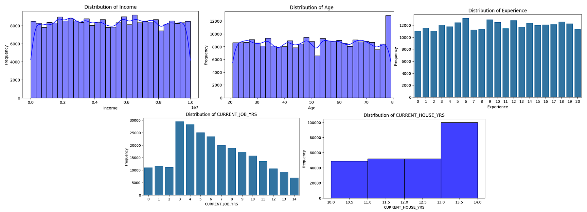

# Loan Approval Prediction Rakamin Datasci

by :

## Table of Content

1. [Dataset](#1-dataset)
2. [Experiment Setup](#2-experiment-setup)
3. [Performance Results](#3-performance-results)
4. [Back Translation Results](#4-back-translation-results)
5. [Conclusion](#5-conclusion)
6. [References](#6-references)

## Dataset

Dataset Used : [Loan Prediction Based on Customer Behavior](https://www.kaggle.com/datasets/subhamjain/loan-prediction-based-on-customer-behavior)

The Dataset contains 252,000 entries
with 13 columns, representing
customer profiles of an Indian Bank for
bank loan applications.

The features include demographic and
financial attributes such as income, age,
years of experience, marital status,
house and car ownership, profession,
city, state, years at the current job, and
years in the current residence.

The target variable,"Risk_Flag" indicates whether a customer is
classified as high-risk (1) or low-risk (0)
for loan default

| Column              | Description                                  | Type   |
| ------------------- | -------------------------------------------- | ------ |
| ID                  | Customer ID                                  | int64  |
| Income              | Income of the user                           | int64  |
| Age                 | Age of the user                              | int64  |
| Experience          | Professional experience of the user in years | int64  |
| Married/Single      | Whether married or single                    | object |
| House Ownership     | Owned or rented or neither                   | object |
| Car Ownership       | Does the person own a car                    | object |
| Profession          | Profession                                   | object |
| City                | City of residence                            | object |
| State               | State of residence                           | object |
| Current Job Years   | Years of experience in the current job       | int64  |
| Current House Years | Number of years in the current residence     | int64  |
| Risk Flag           | Labels: 1 = Default; 0 = Not Default         | int64  |

## Insights

### Numerical Features Distribution

click to zoom
