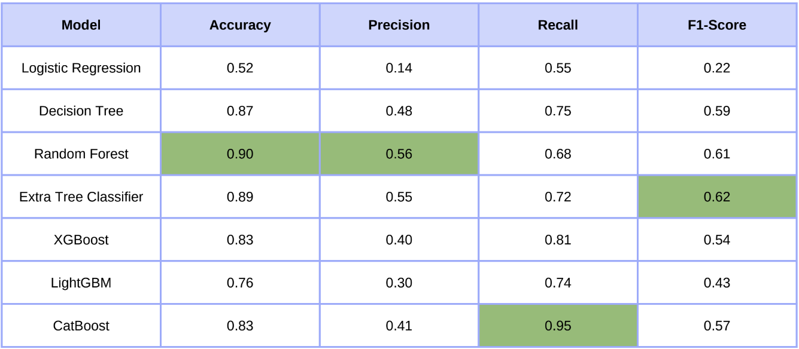

# Loan Approval Prediction Rakamin Datasci

by :

## Table of Content

1. [Dataset](#1-dataset)
2. [Insights](#2-insights)
3. [Data Cleaning and Preprocessing](#3-data-cleaning-and-preprocessing)
4. [Feature Engineering](#4-feature-engineering)
5. [Conclusion](#5-conclusion)
6. [References](#6-references)

## 1. Dataset

Dataset Used : [Loan Prediction Based on Customer Behavior](https://www.kaggle.com/datasets/subhamjain/loan-prediction-based-on-customer-behavior)

The Dataset contains 252,000 entries
with 13 columns, representing
customer profiles of an Indian Bank for
bank loan applications.

The features include demographic and
financial attributes such as income, age,
years of experience, marital status,
house and car ownership, profession,
city, state, years at the current job, and
years in the current residence.

The target variable,"Risk_Flag" indicates whether a customer is
classified as high-risk (1) or low-risk (0)
for loan default

| Column              | Description                                  | Type   |
| ------------------- | -------------------------------------------- | ------ |
| ID                  | Customer ID                                  | int64  |
| Income              | Income of the user                           | int64  |
| Age                 | Age of the user                              | int64  |
| Experience          | Professional experience of the user in years | int64  |
| Married/Single      | Whether married or single                    | object |
| House Ownership     | Owned or rented or neither                   | object |
| Car Ownership       | Does the person own a car                    | object |
| Profession          | Profession                                   | object |
| City                | City of residence                            | object |
| State               | State of residence                           | object |
| Current Job Years   | Years of experience in the current job       | int64  |
| Current House Years | Number of years in the current residence     | int64  |
| Risk Flag           | Labels: 1 = Default; 0 = Not Default         | int64  |

## 2. Insights

### Numerical Features Distribution

_click image to zoom_

Interesting findings are, for the age the dataset are relatively consistent aside from 80+ years old which we see here is considerably more than the rest of the age range

We can also see that the majority of people in the dataset have working experience of 3 years and more, it declines starting from 3 years. The dataset also shows that the majority of people have a house for more or less 13-14 years

### Categorical Features Distribution

_click image to zoom_

Here are the distributions of the categorical features, as we can see the binary features are not balanced, and the target feature as well.

### Multivariate Analysis

#### House Ownership Vs Risk Flag

#### Car Ownership Vs Risk Flag

#### Age Vs Risk Flag

#### Marital Status Vs Risk Flag

Insights :

1. Difficult to distinguish loaners
   high-risk & low-risk loaners with these two
   main factors.
2. Risk evaluation cannot only be
   from simple factors.
3. Need AI & machine learning approach
   learning approach for better accuracy.\

## 3. Data Cleaning and Preprocessing

We can see here that there are no outliers

There are a few inconsistencies on the names of the states and city where some of them will have [XY] added to the end of the name, this have been handled by simply removing all [XY] from the data that has them.

## 4. Feature Engineering

### 1. Career Maturity Index

Because of multicolinearity between Experrience and Current Job Years, we use CMI with the formula above to combine the two.

### 2. Job Groups

There are so many jobs so we decide to group them based on their types.

### 3. Community type

We use the groupings above that are also used by the indian government to groups the State and City of the loaners.

### 4. Encoding Categorical Data

The rest are just encoding the categorical data so it can be processed by the machine learning models.

## Model Selection and Results

Above are all of the models that we decide to experiment to see which is the best for the dataset.

Because the target feature is not balanced, and the topic is risk prediction, we decide to further train CatBoost as it is the one that have the highest Recall score of 95%.

\
After hyperparameter tuning we improve the model further and have a Recall score of **97%**.
